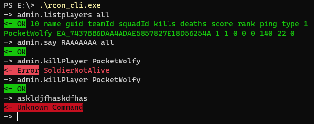

# Rcon CLI

Extremely simple and BF4-specifics-unaware (yet) library to send and receive strings.



Hint: I also read in environment
variables (one per line) from a .env file in the current working directory or up!


```
USAGE:
    rcon_cli [FLAGS] --ip <rcon_ip> --password <rcon_password> --port <rcon_port> [SUBCOMMAND]

FLAGS:
    -r, --raw        Prevents color output and ->, <-. Use this for automated scripts

OPTIONS:
        --ip <rcon_ip>                Sets the RCON IP [env: BFOX_RCON_IP=]
        --password <rcon_password>    Sets the RCON password. If possible, please use an environment
                                      variable or .env file instead! [env: BFOX_RCON_PASSWORD=]
        --port <rcon_port>            Sets the RCON port [env: BFOX_RCON_PORT=]

SUBCOMMANDS:
    query    Send single query and print result, instead of going into interactive mode
    (none)   Enter interactive mode
```


## Example `.env` file
Put this anywhere in your current working directory (or up).
```
BFOX_RCON_IP=12.34.56.78
BFOX_RCON_PORT=30300
BFOX_RCON_PASSWORD=qw3rTY1337
```
